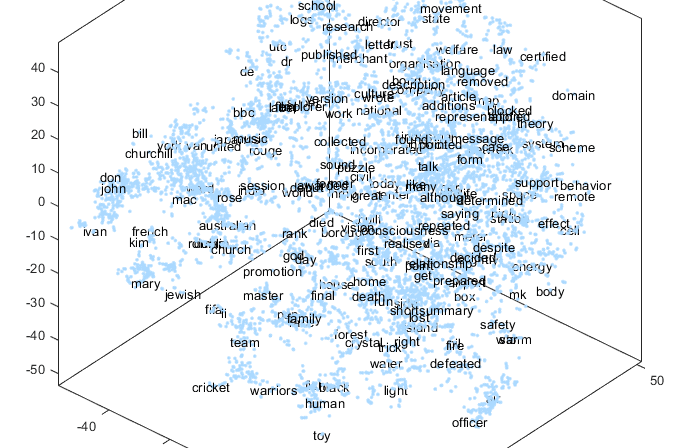
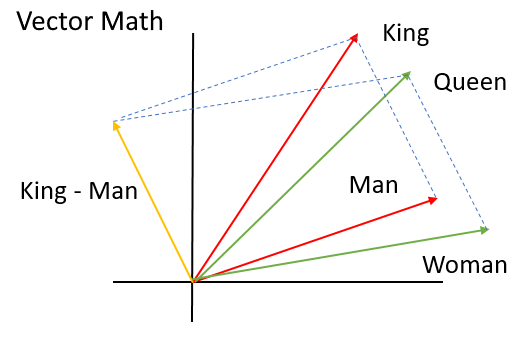

### Text embedding plot with t-SNE

# Toxic Comments Classification – a project for Kaggle Competition
Have you ever thought of how can human’s words or text be classified by a machine? The challenge lies within the fact that text or words are entities of semantic (they have  meaning in language or logic), while machine solves problem based on mathematical representation. In other words, we have to be able to convert the semantics of words into some forms of mathematical representation in order for the machine to work on them. Here I am writing about how the above can be achieved based on a project (a $35,000 prized competition from Kaggle) I have worked on recently.

This project focuses on comments (written by humans) classification. Quoted directly from the Kaggle Competition site:

”

Discussing things you care about can be difficult. The threat of abuse and harassment online means that many people stop expressing themselves and give up on seeking different opinions. Platforms struggle to effectively facilitate conversations, leading many communities to limit or completely shut down user comments.

The Conversation AI team, a research initiative founded by Jigsaw and Google (both a part of Alphabet) are working on tools to help improve online conversation. One area of focus is the study of negative online behaviors, like toxic comments (i.e. comments that are rude, disrespectful or otherwise likely to make someone leave a discussion). So far they’ve built a range of publicly available models served through the Perspective API, including toxicity. But the current models still make errors, and they don’t allow users to select which types of toxicity they’re interested in finding (e.g. some platforms may be fine with profanity, but not with other types of toxic content).

”

This is an example of how a classifier can be developed and trained to classify the data from a huge size of Wikipedia comments which have been labeled by human raters for toxic behavior.

The types of toxicity of the comments to be classified are:

- toxic
- severe_toxic
- obscene
- threat
- insult
- identity_hate

I created a model in Matlab which predicts a probability of each type of toxicity for each comment. The model is also trained to predict the classes.

Since the given data are written human comments, some preprocessing tasks are needed. The algorithm first converts the words into vector based on GloVe, this is done via a thousand iterations of embedding training. Read more about Vector Representations of Words here. This word embedding is the first crucial step before the training of a classifier model. This step embeds words into a continuous vector space where semantically similar words are mapped to nearby points. We can define the vector dimension to represent the words. Here I defined a 250 dimensions, meaning a 250 dimensional vector space is used to map the words.

### A simple analogy of word embedding, where king−man+woman≈queen is represented here in a 2-dimensional vector space. (image credit: Matlab Blogs)

The acquired vectors are then used to train a classifier model based on Long-Short Term Memory Network (LSTM). Since this project is mainly served as a proof of concept, I didn’t spend much time to optimize the model’s parameters. After some preliminary trials, the LSTM was configured with the following parameters and architecture (see diagram below):

- sequence input layer size: 250 (similar to the embedding dimension)
- LSTM layer output size: 512 nodes

### A Long-Short Term Memory Network used for the classifier.

The training parameters:

- Maximum epoch: 2000
- Mini-batch size: 1000
- Shuffle: every epoch
- Optimizer: stochastic gradient descent with momentum
- Learning rate: 0.01

A huge size of data was used in the training (a total of 159571 samples). After about a week of model training, the trained network is able to predict the classes up to 97% of accuracy for the test set. You may download the data from the official site if you registered for the competition (the competition is due on 21/3/2018). By the time of this posting, the top team in the competition has achieved 98.85% of accuracy. Bet I am not in for the $35,000 prize! 

